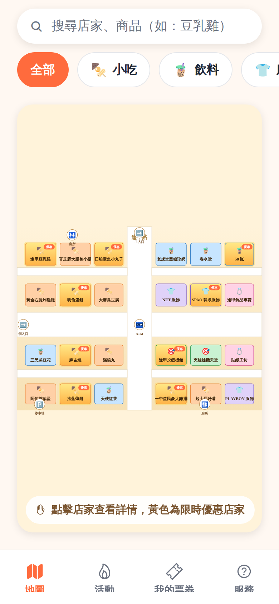
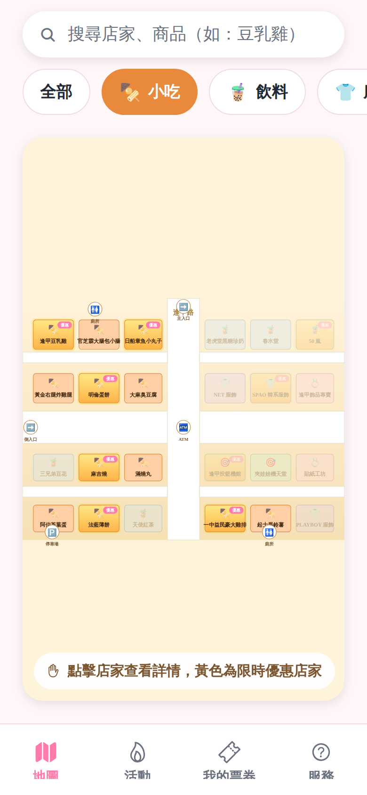
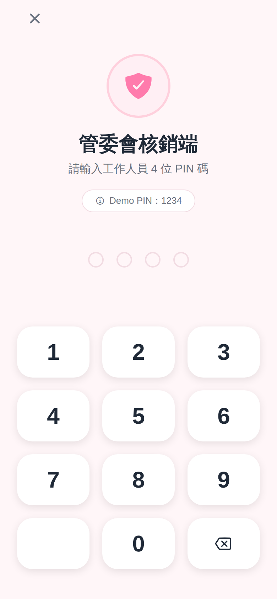
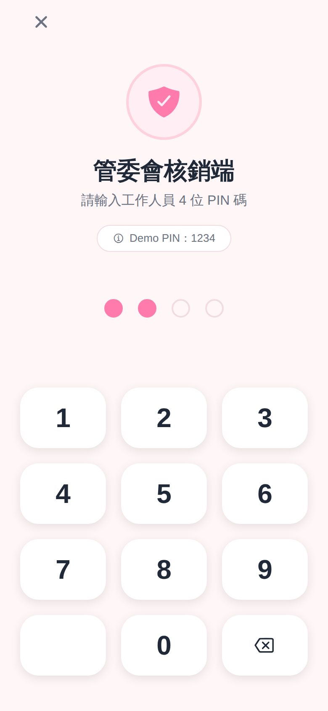
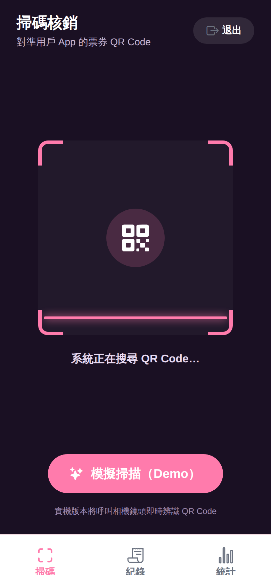
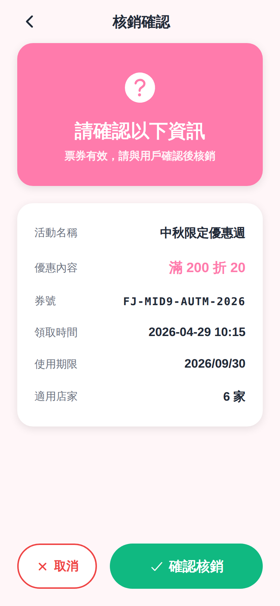
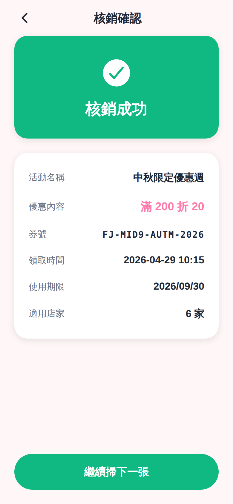
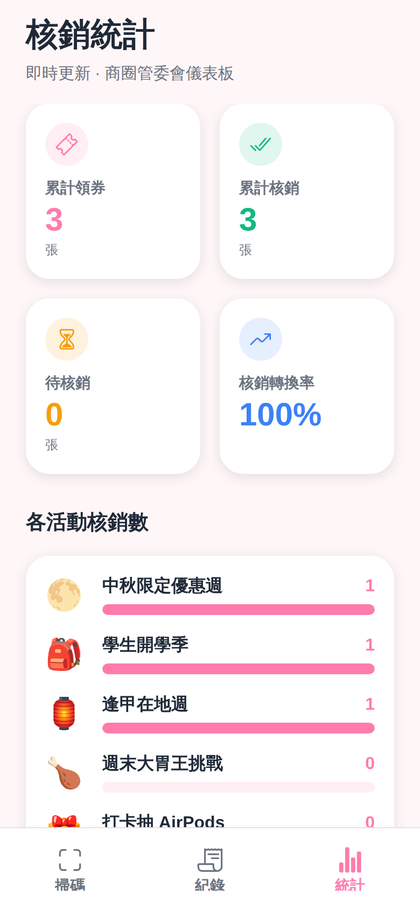

# 玩轉逢甲 App — UI 原型截圖

iPhone 14 Pro (390×844 @2x) 模擬，瀏覽器經由 React Native Web 渲染。
字型：粉圓體 jf-openhuninn。主色：少女粉。

## 0. 歡迎頁
首次開啟看到的歡迎頁，動畫燈籠 logo + 三大功能說明 + 「開始探索」CTA。

## 1. 地圖主頁
互動式 SVG 商圈地圖，24 家逢甲店家、街道、廁所/ATM/停車場/入口地標。優惠店家有金色光暈與紅色「優惠」標籤。

## 2. 地圖 + 「小吃」篩選
點擊分類 chip 後，非該類別店家會淡化，幫助使用者聚焦。

## 3. 店家底部抽屜
點擊地圖上的店家 → 底部滑出店家資訊：招牌、營業時間、可領取的優惠券、導航/收藏 CTA。

## 4. 我的票券
領券後自動進入「我的票券」，狀態（未使用 / 已使用）以顏色區分。

## 5. QR Code 票券
帶有微脈動動畫的 QR Code、券號、領取時間、使用期限、模擬「管委會掃碼核銷」按鈕（Demo）。

## 6. 活動列表
管委會精選活動，HOT 徽章、benefit chip、活動期間。

## 7. 活動詳情
活動 Hero block、活動期間、核銷地點、適用店家、立即領券 CTA。

## 8. 服務
管委會公告、商圈設施統計、聯絡管委會。

---

# 管委會核銷端（Admin Mode）

從歡迎頁底部「管委會核銷端」入口進入，與用戶 App 共用同一份 codebase 與資料狀態。Demo PIN：`1234`。

## A1. PIN 登入
4 位 PIN 鍵盤、防呆紅圈、Demo PIN 提示 chip。

## A2. PIN 輸入中
輸入 2 位後的填色 dots 狀態。

## A3. 掃碼介面
深色相機介面、4 角 L 形角標、脈動掃描線、QR icon、模擬掃描 CTA。

## A4. 模擬掃描選單
從未使用票券中挑一張模擬掃到該張的 QR Code（實機將直接呼叫相機）。

## A5. 核銷預覽
驗證通過時顯示活動、優惠、券號、領取時間、適用店家數，請工作人員與用戶確認後再核銷。

## A6. 核銷成功
綠色 hero 確認、繼續掃下一張 CTA。失敗時改為紅色並顯示原因（已使用 / 過期 / 查無此票券）。

## A7. 核銷紀錄
依時間倒序列出每筆核銷：活動、優惠、券號、時間、工作人員 ID。

## A8. 核銷統計儀表板
4 張 KPI 卡：累計領券、累計核銷、待核銷、轉換率。下方各活動核銷數橫條圖。

